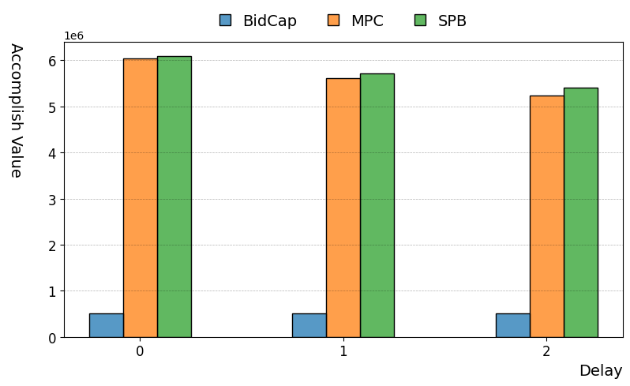
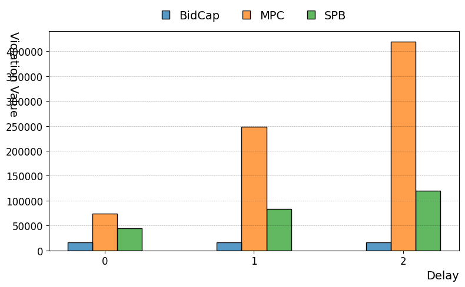
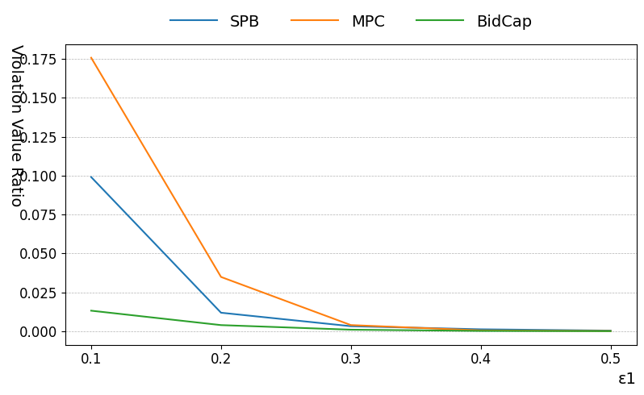

## Spending Programmed Bidding

This repository contains the source code for the bidding strategy used in 'Spending Programmed Bidding: Privacy-friendly Bid Optimization with ROI Constraint in Online Advertising.' It employs a modified version of [Auction Gym](https://github.com/amzn/auction-gym) as the simulation environment.

## Framework Modification

To demonstrate the SPB strategy, we've made the following modifications to the Auction Gym framework:

- Introduced a delay in the feedback for conversions (clicks) and aggregation restrictions simulated from privacy regulations.
- Added perturbation to the estimation of conversion (click) rate to simulate unstable estimations in a privacy-protected environment.
- Implemented a budget restriction for each iteration.

## Environment Settings

- Each bidder bids for a single campaign in a single run; thus, each bidder, other than the environment bidder, has only one item, and its value is fixed over several budget cycles in that run.
  Before each run begin the campaign setting is random configured. Campaign setting including budget limit, item value and item embeddings.
- Each iteration is treated as a budget cycle for the campaign, each run has a fix number of iterations and this number is 20 by default.
- The performance of the bidding results is evaluated according to the standard described in the Spending Programmed Bidding paper.

## Run Simulation

To simulate with the SPB strategy using the default config, run:

```
python src/main.py config/SPB.json
```

This will simulate a campaign using the SPB strategy against an environment for several budget cycles.

Here is a simple example that simulate 5 rounds with delay window of 2 and result stored at `results/spb5_2`.

```
python src/main.py -n 5 -d 2 -o results/spb5_2 config/SPB.json
```

## The Offline Experiment

The offline experiment simulate each bidder with 500 random campaigns (runs) under different postback delay settings. 

### Reproduction scripts

Simulation:
```
python src/main.py -n 500 -d 0 -o results/spb500_0 config/SPB.json
python src/main.py -n 500 -d 1 -o results/spb500_1 config/SPB.json
python src/main.py -n 500 -d 2 -o results/spb500_2 config/SPB.json

python src/main.py -n 500 -d 0 -o results/mpc500_0 config/MPC.json
python src/main.py -n 500 -d 1 -o results/mpc500_1 config/MPC.json
python src/main.py -n 500 -d 2 -o results/mpc500_2 config/MPC.json

python src/main.py -n 500 -d 0 -o results/bid_cap500_0 config/BidCap.json
python src/main.py -n 500 -d 1 -o results/bid_cap500_1 config/BidCap.json
python src/main.py -n 500 -d 2 -o results/bid_cap500_2 config/BidCap.json
```

Result compare and report generation:
```
python src/compare.py -f png results/spb500_0 results/spb500_1 results/spb500_2 results/mpc500_0 results/mpc500_1 results/mpc500_2 results/bid_cap500_0 results/bid_cap500_1 results/bid_cap500_2
```
### Overall Performance Comparisons

In line with the online experiment findings, offline results also demonstrate that, compared to other methods, the SPB bidding method can effectively enhance Value (referred to as GMV in the paper) within the Accomplish group while reducing Value in the Violation group.

Figure 1:
    

Figure 2:
    

Figures 1 and 2 respectively depict the ratio of Value (referred to as GMV in the paper) for the Accomplish and Violation groups across different delays. As can be seen, in the span of 0-3 days delay, the SPB method has the highest proportion in the Accomplish group, and this advantage amplifies as the delay increases. On the other hand, the proportion of the Violation group using the MPC method increases dramatically as delay prolongs. In contrast, the SPB method exhibits a much slower rate of increase, suggesting that the SPB method is more effective in countering stringent privacy policies.

### In-Depth ROI Analysis

Here we compare the performance of all bidding methods across different values of $`\epsilon1`$.

Figure 3:
    

Figure 4:
    

As mentioned in the paper, $`\epsilon1`$ is the ROI volatility tolerance parameter. According to Figure.3, the SPB bidding method sees less increase in the violation group’s Value(referred to as GMV in the paper)  ratio compared to the mpc method when reducing the ROI volatility tolerance. Meanwhile, due to its necessity to strictly meet the ROI target in each auction of our offline experiment, the BidCap method yields the smallest violation group Value ratio. 
To further analyze the ROI constrained optimization capability of the SPB bidding method, we list the Value distribution over $`ROI_{result}/ROI_{target}`$ in Figure4. We can see that the Value distribution of SPB is shifted towards $`ROI_{result}/ROI_{target} = 1`$ compared to other bidding methods in our uniform offline environment. In more intricate industrial environments, similar to our paper's findings, the SPB bidding method could generate more Value with  $`ROI_{result}/ROI_{target} \ge 2.5+`$ compared to other bidding methods. 

